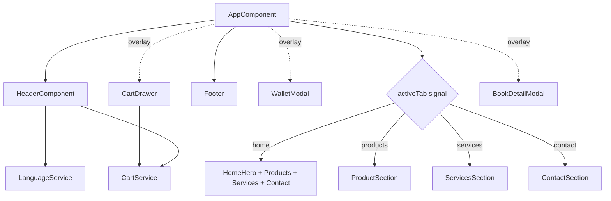
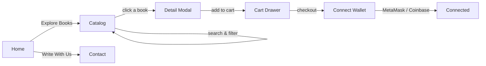
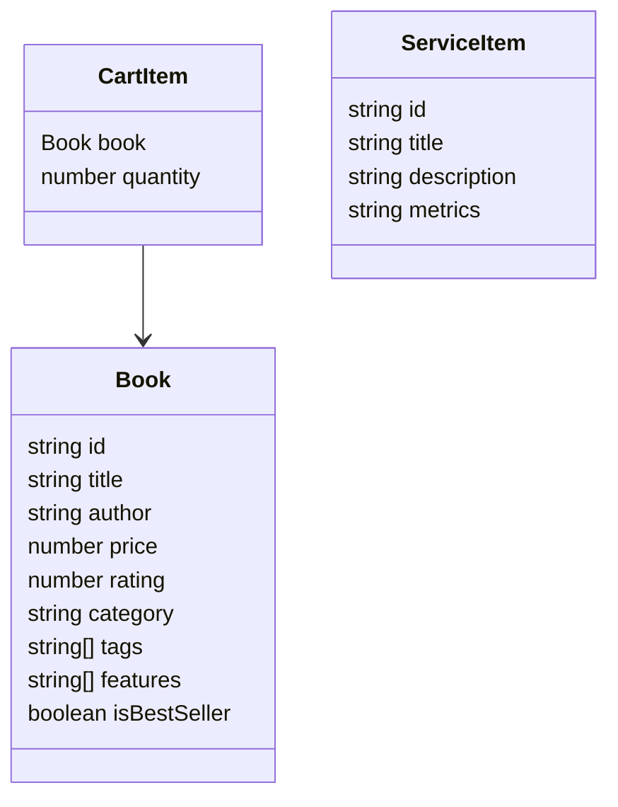
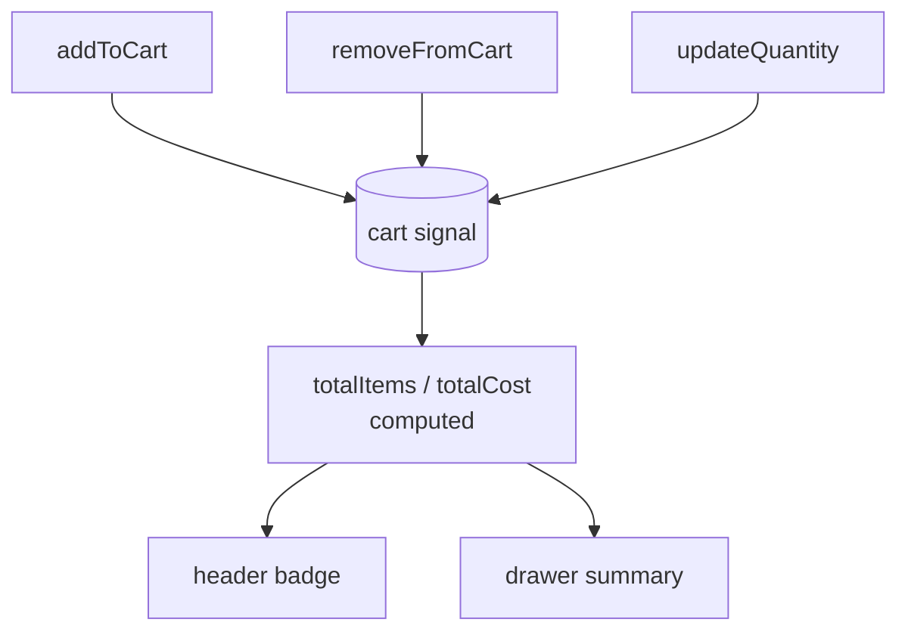

<div align="center">

# FAO Books Store

An interactive tech bookstore built with Angular 17. Dark neumorphic UI, full Arabic/English support with proper RTL/LTR switching, a shopping cart, and a Web3 wallet connection modal.


</div>

---

## Diagrams

> These diagrams are written in [Mermaid](https://mermaid.js.org/). GitHub renders them automatically. If you're reading in an editor without Mermaid support, paste the code block into the [Mermaid Live Editor](https://mermaid.live).

### How to read them

There are four diagrams, each answering a different question:

| Diagram | Answers |
| --- | --- |
| Component structure | What is mounted, and what talks to what |
| User flow | How a visitor moves from landing to checkout |
| Data model | What the core objects hold and how they relate |
| Cart state flow | How a cart change ends up on screen |

Notation used across them:

- **Solid arrow** (`-->`) — a direct relationship: a parent rendering a child, or one step leading to the next.
- **Dotted arrow** (`-.label.->`) — a looser link, used here for the floating overlays that sit above the page rather than inside the tab layout.
- **Diamond node** (`{ }`) — a decision or switch. In the component diagram it's the `activeTab` signal choosing which view to show.
- **Rounded/cylinder node** (`( )`, `[( )]`) — a value or store, such as the `cart` signal.
- **Edge label** (text on an arrow) — the trigger for that transition, like a button click or a tab value.

### Component structure

`AppComponent` is the root. It keeps the header and footer mounted at all times, swaps the main content by active tab, and holds three floating overlays above everything else.



### User flow



### Data model



### Cart state flow

State runs entirely on Angular Signals, no external library. `totalItems` and `totalCost` are derived values that recompute on any cart change.



---

## What is this?

A marketplace for programming books, aimed at technical authors and the engineers who read them. The idea is that a book never ships alone — it comes with a live code sandbox in the browser, a private discussion channel, and several download formats with no DRM.

The whole thing is a single-page app that swaps content through tabs without reloading. The design is dark with pink and purple neon accents, and the animations are tied to the background video being ready, so nothing moves before the picture shows up.

The part worth pointing out: the site is fully bilingual. Switching to Arabic doesn't just translate text — it flips the layout to RTL, changes the font, and mirrors the directional icons.

---

## Sections

Each screenshot below is one part of the app.

### 1. Home (Hero)


The first screen. A large headline, a live countdown to the next release, and a silent background video that autoplays. The pre-headline and title arrive with a "rise out of a glowing slit" animation, and the columns slide in from the screen edges once the video actually starts. Right below sits the featured book card.

### 2. Catalog


Six tech books across five categories: architecture, systems, frontend, AI, and backend. There's an instant search box, category filters, and a sort dropdown. Each card shows the rating, review count, tags, and price.

### 3. Book detail


A modal that opens when you click a book. It carries the synopsis, the key features, rating and page count, the price, and the add-to-cart button.

### 4. Cart


A slide-in drawer. Adjust quantities, remove items, watch the total update live, and head to checkout — which opens the wallet connection.

### 5. Services


Six services explaining what makes buying here different: live code sandboxes, download in any format, direct author Q&A, team and company portals, a private channel per book, and print editions shipped worldwide.

### 6. Wallet connection


A simulated Web3 connection modal with MetaMask, Coinbase, WalletConnect, and Phantom. Connecting keeps a purchase tied to the wallet.

### 7. Arabic (RTL)


The same site in Arabic. The layout mirrors right-to-left, the font switches, and the directional icons flip. One toggle in the header swaps the whole experience.

> There's also a Contact section (a terminal-styled form) reachable from the nav — no separate screenshot, but it shares the same visual language.

---

## Tech stack

| Layer | Tool |
| --- | --- |
| Framework | Angular 17 — standalone components and Signals |
| Styling | Tailwind CSS v4 with custom CSS variables |
| Builder | `@angular-devkit/build-angular:browser-esbuild` |
| Icons | `lucide-angular` |
| State | Angular Signals, no external library |
| Languages | In-house translation system (EN / AR) with RTL switching |

---

## Run locally

Requirements: Node.js 18 or newer, and npm.

```bash
npm install
npm run dev
```

Then open [http://localhost:3000](http://localhost:3000).

### Available scripts

| Script | What it does |
| --- | --- |
| `npm run dev` | Start the dev server on port 3000 with HMR |
| `npm run build` | Production build into `dist/` |
| `npm run preview` | Serve the built app |
| `npm run lint` | Type-check the project (`tsc --noEmit`) |

---

## Project structure

```
src/
  app/
    components/     UI components (header, hero, cart, modals...)
    services/       cart and language services
    app.component.ts root and overall layout
  data/             books, services, translations
  index.css         Tailwind v4 entry + custom theme
  index.html        app shell
  main.ts           bootstrap
docs/media/         README images
.postcssrc.json     PostCSS plugin config (required by Tailwind v4)
angular.json        Angular CLI config
```

---

## Technical notes

PostCSS plugins load from `.postcssrc.json` in JSON form, because Angular's esbuild builder doesn't read JavaScript-based PostCSS configs.

Tailwind v4 scans the working directory for templates automatically, so there's no need for a manual `@source` directive.
